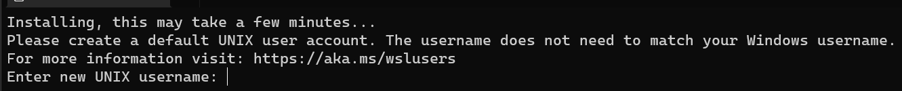
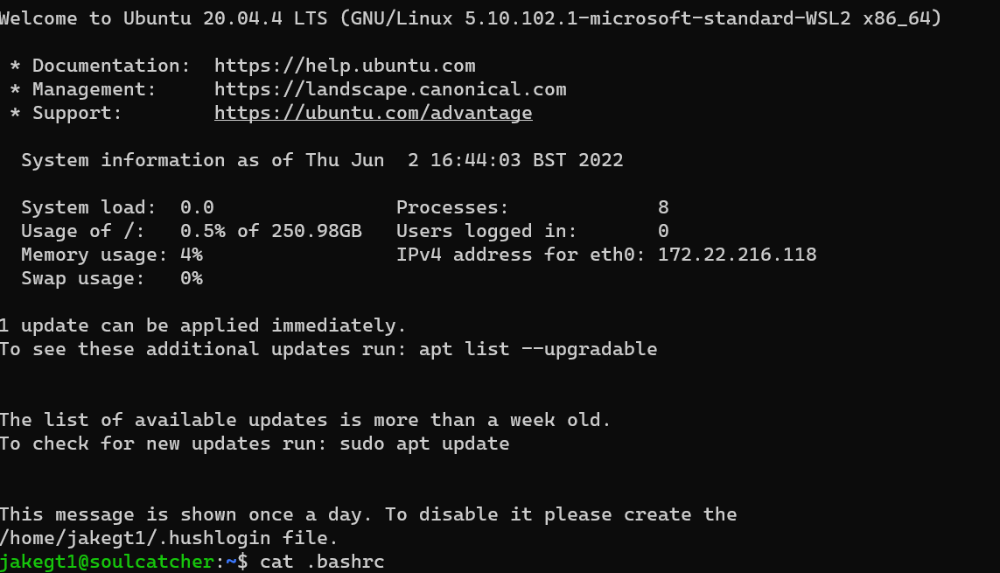

# Linux How-To

This project is just a quick tutorial on how to use linux, specifically:

* How the terminal works (aka, the BASH shell)
* Making projects in linux

## Preqreuisites

* Install Ubuntu via WSL (you can do this by going on the Microsoft Store application and searching 'Ubuntu')
* Install VSCode **And the ms-vscode-remote.vscode-remote-extensionpack extension**

Once you have installed Ubuntu, you should open it. It will show you a screen like so:

For your UNIX username, just use whatever you like. In workplaces, this will typically be some variant of your name - For me, i have had `jtorranc` and `jake.torrance` - although the shorter the better i find. Typically though, i'll just use `jakegt1`, which is a handle i've used since well, forever.

For a password, just put something simple - doesn't need to be something you'll put in a password manager.

After this, you'll boot into the shell:

Then, it's time to access the first tutorial.