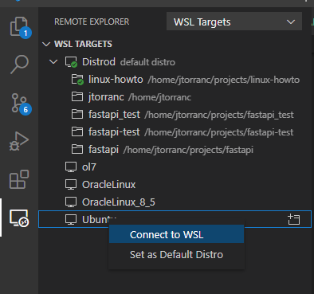

# 03_Scripting

So, let's get our environment ready for scripting.

if you're not already, use `cd` to get to your HOME directory. You can use either:

```bash
cd ~
cd "$HOME"
```

Now, we'll make a directory for our work. Let's call it `projects`:

```bash
jakegt1@soulcatcher:~$ mkdir projects
jakegt1@soulcatcher:~$ cd ./projects/ # ./ - current directory
jakegt1@soulcatcher:~/projects$
```

There are some files in this git repo which will be used for the tasks in this readme. So, best to clone this git repo. For now, we can just use https cloning as it's simpler, but for an extension task you can try set up an ssh key - it's much faster to clone that way. [See here](https://docs.github.com/en/authentication/connecting-to-github-with-ssh/generating-a-new-ssh-key-and-adding-it-to-the-ssh-agent)

Try it yourself, it should be the same as cloning on windows.

<details>
  <summary>If you're not sure, click here</summary>
  ```
  git clone https://github.com/jakegt1/HowToLinux.git
  git clone git@github.com:jakegt1/HowToLinux.git
  ```
</details>

At this point, it would be better to get onto VSCode. Make sure you have installed the `Remote Development` extension.



After that, you should have a terminal pop up. `cd` to the cloned repository and then type `code -r .` to open this project in VSCode.

The test harness and scripts are in [../03_Scripting/](../03_Scripting). First, we should run test.sh to see where we're at.

```bash
jtorranc@soulcatcher:~/projects/LinuxHowTo$ cd 03_Scripting
jtorranc@soulcatcher:~/projects/linuxHowTo/03_Scripting$ ./test.sh
 ✗ Concat two strings can concat two strings
   (in test file test.sh, line 4)
     `result="$(./concat_two_strings.sh foo bar)"' failed with status 126
   /tmp/bats.3059.src: line 4: ./concat_two_strings.sh: Permission denied
 ✗ Add can add two
   (in test file test.sh, line 9)
     `result="$(./add.sh 2 6)"' failed with status 126
   /tmp/bats.3067.src: line 9: ./add.sh: Permission deniede
```

Ahh, permissions again. We'll use `chmod` to fix that.

`chmod` can work in multiple ways:

```bash
chmod u+x ./add.sh ./concat_two_strings.sh # Add the execution permission to the user (the owner)
chmod a+x ./add.sh # Add the execution permission to everyone
chmod 755 ./add.sh # Short form - 755: `rwxr-xr-x`
chmod 644 ./add.sh # Short form - 644: `rw-r--r--`. This is what it starts with.
```

I find the short form much easier to understand, to be honest. You will almost always use 755 and 644, and ocasionally 600 or 400 when you want something that cannot be read by others (like an ssh key!)

OK, let's try again..